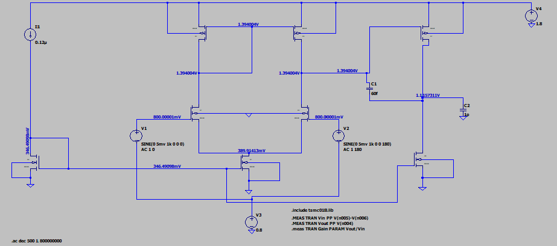

# TSMC 0.18μm CMOS Operational Transconductance Amplifier (OTA) - LTspice Simulation

This repository contains a complete LTspice simulation of a **two-stage Miller-compensated Operational Transconductance Amplifier (OTA)** designed using **TSMC 0.18μm CMOS technology**.



## 📁 Project Structure

```
.
├── README.md                          # This file
├── OTA.png                            # Schematic screenshot
├── .gitignore                         # Ignores raw simulation data
├── simulations/
│   ├── OTA.asc                        # Main LTspice schematic (open this file)
│   ├── OTA.plt                        # Plot settings for waveforms
│   ├── tsmc018k.lib                   # TSMC 0.18μm BSIM3 model library (local copy)
│   ├── cmosn.asy                      # NMOS 4-terminal symbol
│   └── cmosp.asy                      # PMOS 4-terminal symbol
└── verify_setup.bat/.sh               # Setup verification scripts
```

## 🚀 Quick Start

### Prerequisites
- **LTspice XVII** (or LTspice IV) - [Download from Analog Devices](https://www.analog.com/en/design-center/design-tools-and-calculators/ltspice-simulator.html)

### Running the Simulation

1. **Clone the repository:**
   ```bash
   git clone https://github.com/yourusername/tsmc018-ota-ltspice.git
   cd tsmc018-ota-ltspice
   ```

2. **Verify setup (optional):**
   - Windows: `verify_setup.bat`
   - Linux/Mac: `./verify_setup.sh`

3. **Open the simulation:**
   - Launch LTspice
   - File → Open → Select `simulations/OTA.asc`
   - **The simulation runs immediately** - all models and symbols are self-contained

4. **Run simulations:**
   - Press **Run** (▶) or `Ctrl+R` to run the default transient analysis
   - Use the **Simulation Command** menu to switch between analysis types:
     - `.tran` - Transient analysis (default)
     - `.ac` - AC frequency response (uncomment the `.ac` line in the schematic)
     - `.op` - DC operating point

## 🔧 OTA Design Specifications

| Parameter | Value | Description |
|-----------|-------|-------------|
| **Technology** | TSMC 0.18μm CMOS | BSIM3 Level 49 models |
| **Topology** | Two-stage Miller-compensated OTA | Differential input, single-ended output |
| **Supply Voltage (VDD)** | 1.8 V | Single supply |
| **Bias Current (Ibias)** | 120 nA | Ultra-low power |
| **Input Common-Mode** | 0.8 V | Set by V3 |
| **Load Capacitance (CL)** | 1 pF | Output load (C2) |
| **Compensation Capacitor (Cc)** | 60 fF | Miller compensation (C1) |

### Transistor Sizing

| Transistor | Type | W/L (μm/μm) | Function |
|------------|------|-------------|----------|
| M1, M2 | NMOS | 0.18 / 0.18 | Input differential pair |
| M3 | NMOS | 0.18 / 0.18 | Current mirror (diode-connected) |
| M4, M5 | PMOS | 0.54 / 0.18 | Current mirror load |
| M6 | NMOS | 0.18 / 0.18 | Bias current source |
| M7 | PMOS | 3.6 / 0.18 | Output stage (PMOS) |
| M8 | NMOS | 0.18 / 0.18 | Output stage (NMOS) |

## 📊 Simulation Analyses Included

### 1. Transient Analysis (Default)
```spice
.tran 100u 10m 0 10u
```
- **Input**: Differential sine wave, 5 mV amplitude, 1 kHz (V1, V2)
- **Measurements** (via `.meas`): 
  - Input peak-to-peak voltage (Vin = V(n005)-V(n006))
  - Output peak-to-peak voltage (Vout = V(n004))
  - Voltage gain (Vout/Vin)

### 2. AC Analysis (Uncomment to use)
```spice
.ac dec 500 1 800000000
```
- Frequency sweep: 1 Hz to 800 MHz
- 500 points per decade
- Measures: Gain, Phase, GBW, Phase Margin

### 3. DC Operating Point
```spice
.op
```
- Calculates DC bias voltages and currents
- Useful for verifying transistor operating regions

## 📈 Expected Results

### Typical Performance (from simulation)
| Metric | Typical Value |
|--------|---------------|
| **DC Gain** | ~60-70 dB |
| **Unity Gain Bandwidth (GBW)** | ~1-5 MHz |
| **Phase Margin** | ~60-70° |
| **Slew Rate** | ~0.5-2 V/μs |
| **Power Consumption** | ~216 nW (1.8V × 120nA) |
| **Input Referred Noise** | ~μV/√Hz range |

### Example Waveforms

#### Transient Response
The default transient analysis shows the amplifier's response to a 1 kHz differential input signal.

#### AC Frequency Response
Enable `.ac dec 500 1 800000000` to see:
- **Magnitude**: DC gain, -3dB bandwidth, GBW
- **Phase**: Phase margin at unity gain frequency

## 🛠️ How It Works

### Circuit Architecture

```
                    VDD (1.8V)
                     │
                     M7 (PMOS, W=3.6μm)
                     │
            ┌────────┴────────┐
            │                 │
            M4 (PMOS)        M5 (PMOS)
            │                 │
            └────────┬────────┘
                     │
            ┌────────┴────────┐
            │                 │
           M1 (NMOS)         M2 (NMOS)
            │                 │
            └────────┬────────┘
                     │
                    M6 (NMOS, Ibias=120nA)
                     │
                    GND
```

### Key Design Features

1. **Differential Input Pair (M1, M2)**
   - NMOS transistors for higher transconductance (μn > μp)
   - Matched sizing (W=0.18μm, L=0.18μm) for symmetry and CMRR
   - Tail current set by M6 biased at 120 nA

2. **Active Current Mirror Load (M3, M4, M5)**
   - M3 diode-connected, mirrors current to M4 and M5
   - PMOS current mirror converts differential to single-ended
   - Provides high output impedance at first stage

3. **Miller Compensation (C1 = 60 fF)**
   - Connected between gate of M7 (first stage output) and final output
   - Creates dominant pole at first stage for stability
   - Right-half-plane zero managed by transistor sizing

4. **Class AB Output Stage (M7, M8)**
   - PMOS (M7, W=3.6μm) and NMOS (M8, W=0.18μm) push-pull
   - Large PMOS for sourcing current to 1 pF load
   - Drives 1 pF load capacitance (C2)

5. **Bias Circuit (M6 + I1)**
   - 120 nA ideal current source (I1) sets tail current
   - V3 (0.8V DC) sets input common-mode voltage
   - M6 acts as current mirror reference for tail current

## 📂 File Details

### `simulations/OTA.asc` - Main Schematic
- Contains complete circuit with all components
- Includes simulation commands (`.tran`, `.ac`, `.meas`)
- References model library via `.include ./tsmc018k.lib`
- Pre-configured plot settings for key waveforms
- Uses **unique model names** `CMOSN_018`/`CMOSP_018` to avoid system library conflicts

### `simulations/tsmc018k.lib` - BSIM3 Model Library (Local Copy)
- **CMOSN_018**: NMOS model (Level 49, BSIM3v3.1)
- **CMOSP_018**: PMOS model (Level 49, BSIM3v3.1)
- Parameters extracted from TSMC 0.18μm process
- Includes flicker noise parameters
- **Unique model names prevent conflicts** with LTspice's built-in `standard.mos`

### `simulations/cmosn.asy` & `cmosp.asy` - Custom Symbols
- 4-terminal MOSFET symbols (D, G, S, B) with explicit bulk connection
- Linked to `tsmc018k.lib` via `ModelFile` attribute
- Prefixes: `MN` for NMOS, `MP` for PMOS
- Used in schematic with `Value2` overriding model name

## 🔒 Model Isolation (Important for Portability)

This design uses **unique model names** to guarantee the correct models are used:

```spice
* In tsmc018k.lib:
.MODEL CMOSN_018 NMOS ( ... )   * Unique name
.MODEL CMOSP_018 PMOS ( ... )   * Unique name

* In OTA.asc (Value2 field on each transistor):
CMOSN_018
CMOSP_018
```

**Why this matters:**
- LTspice automatically injects `.lib standard.mos` (generic models)
- Generic `standard.mos` also defines `CMOSN`/`CMOSP`
- Without unique names, simulation might silently use wrong models
- With `CMOSN_018`/`CMOSP_018`, **only your library defines them** - guaranteed isolation

### Verification Test
```bash
# Rename local library
mv simulations/tsmc018k.lib simulations/tsmc018k.lib.test

# Run simulation → MUST FAIL: "Can't find definition of model CMOSN_018"

# Restore
mv simulations/tsmc018k.lib.test simulations/tsmc018k.lib

# Run → Works with YOUR models only
```

## 🔄 Modifying the Design

### Changing Transistor Sizes
1. Right-click on any transistor in the schematic
2. Modify the `Value2` field (format: `l=XXX w=YYY`)
3. Example: `l=0.18u w=1.8u` for 10× width

### Changing Bias Current
1. Right-click on current source `I1`
2. Modify value (default: `120n`)

### Changing Supply Voltage
1. Right-click on `V4`
2. Modify value (default: `1.8`)

### Adding New Analyses
Add SPICE directives via `Edit → SPICE Directive`:
```spice
* Noise analysis
.noise V(out) V1 dec 100 10 100Meg

* PSRR analysis
.ac dec 100 10 1G

* Monte Carlo (if models support it)
.step param W1 list 0.18u 0.36u 0.54u
```

## 🐛 Troubleshooting

| Issue | Solution |
|-------|----------|
| **"Can't find model CMOSN_018"** | Ensure `tsmc018k.lib` is in `simulations/` folder next to `OTA.asc` |
| **"Unknown symbol cmosn"** | Verify `cmosn.asy` and `cmosp.asy` are in `simulations/` folder |
| **Simulation fails to converge** | Try adding `.options gmin=1e-12` or increase `ITL4` |
| **Symbols show as boxes** | Restart LTspice after adding `.asy` files |
| **Wrong results (gain/bandwidth)** | Verify `.include ./tsmc018k.lib` is present and models are `CMOSN_018`/`CMOSP_018` |

## 📚 References

1. **Razavi, B.** - *Design of Analog CMOS Integrated Circuits*, Ch. 9 (OTAs)
2. **TSMC 0.18μm Process Documentation** - Model parameters source
3. **LTspice Help** - `.meas`, `.ac`, `.tran` command syntax
4. **Gray, Hurst, Lewis, Meyer** - *Analysis and Design of Analog Integrated Circuits*

## 📄 License

This project is provided for educational and research purposes. The TSMC model parameters are subject to TSMC's licensing terms.

## 🤝 Contributing

Feel free to:
- Report issues with simulation convergence
- Suggest design improvements
- Add new analysis types
- Document additional results

---

**Note**: This simulation uses `.include ./tsmc018k.lib` which expects the library file in the **same directory as the schematic** (`simulations/`). The unique model names `CMOSN_018`/`CMOSP_018` ensure no conflicts with system libraries. If you move files, update the `.include` path accordingly.# TSMC 0.18μm CMOS Operational Transconductance Amplifier (OTA) - LTspice Simulation

This repository contains a complete LTspice simulation of a **two-stage Miller-compensated Operational Transconductance Amplifier (OTA)** designed using **TSMC 0.18μm CMOS technology**.


## 📁 Project Structure

